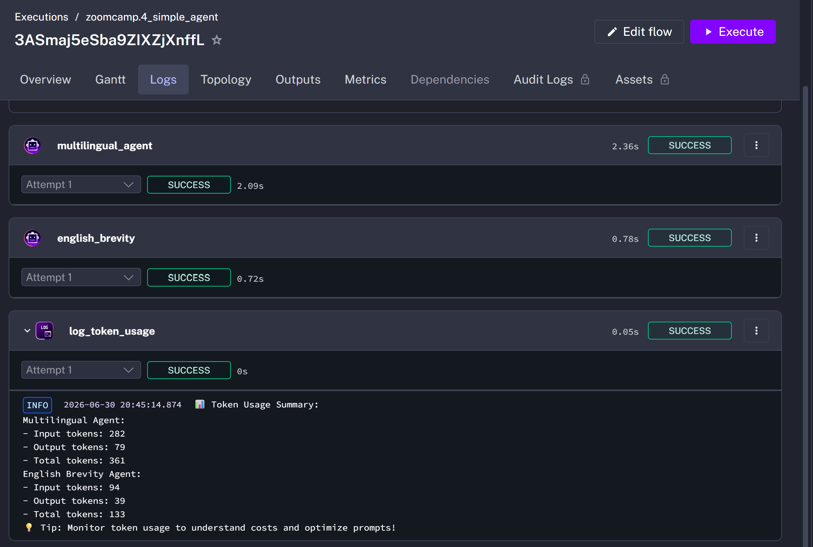
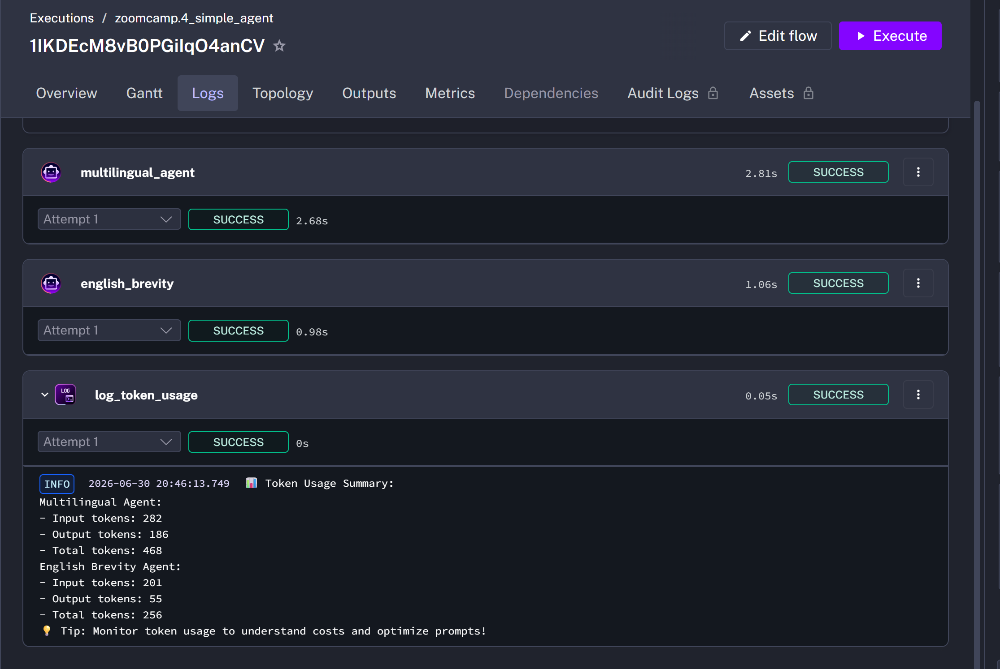
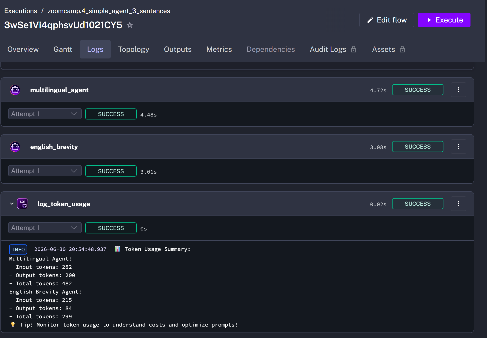

# LLM Zoomcamp 2026 - Homework 3: Orchestration

## Overview

This repository contains my solution for **Homework 3: Orchestration** from the LLM Zoomcamp 2026 course.

**Homework:** Orchestration

**Deadline:** July 6, 2026, 20:00 (GMT-3)

---

## Questions

### Question 1

After trying the same prompt in ChatGPT vs Kestra AI Copilot, what is the primary reason AI Copilot generates better Kestra flows?

- AI Copilot uses a more powerful model
x AI Copilot has access to current Kestra plugin documentation
- AI Copilot uses more tokens
- AI Copilot has internet access

---

### Question 2

The non-RAG response about Kestra 1.1 features is best described as:

- Accurate and specific, matching the actual release notes
x Vague, generic, or fabricated — the model guesses from training data
- Empty — the model refuses to answer without context
- Identical to the RAG version

---

### Question 3

What is the approximate output token count for `multilingual_agent` when running with `summary_length = short`?

- 5–15 tokens
x 60–100 tokens
- 200–400 tokens
- 500+ tokens

---

### Question 4

With `summary_length = long`, roughly how many times more output tokens does `multilingual_agent` use compared to the short summary?

- About the same (within 20%)
x 2–5× more
- 10–20× more
- 50× more

---

### Question 5

After changing `english_brevity` to ask for **3 sentences** instead of **1**, how does the output token count compare to the original version?

- About the same (within 20%)
x 2–4× more
- 5–10× more
- 10×+ more

---

### Question 6

For production workflows requiring deterministic, repeatable results with strict compliance requirements, which approach is most appropriate?

- Always use AI agents for maximum flexibility and adaptation
x Use traditional task-based workflows for predictability and auditability
- Use only RAG without agents for better performance
- Use web search tools exclusively to ensure current data

---

